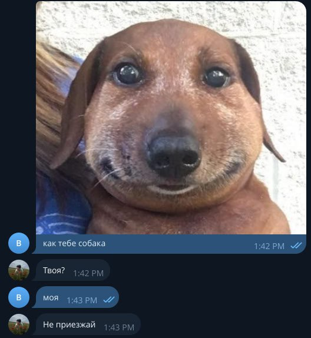

# Hey there! 👋

I'm Dmitry — currently studying at **HSE (Higher School of Economics)** on the **ADA&AI** program at the **SIPT (ШИФТ) faculty**, in partnership with VK.  
Tech enthusiast, code enjoyer, and someone who's been deeply into programming for quite a while.

### 👨‍💻 About me:
- 🧠 Passionate about **Machine Learning**, **AI**, and creative problem solving  
- 🤖 Built multiple **Telegram bots** — from utility tools to full-featured conversational agents  
- 💻 Comfortable with Python, C++ and the dark arts of prompt engineering  
- 🌱 Always learning something new  
- 📍 Based in **Saint Petersburg, Russia**

---

### 🚀 Projects I've worked on:
- **ChatGPT-powered Telegram bot** with customizable tone and moderation bypass  
- **Sticker-based Telegram casino** 🎰  
- A **3D exploration game** built with C# for a school project  
- **Neural network that learns to play the MxNxKxD game** using reinforcement learning
- Several fun and weird things with C++, including some spicy lab work

---

### ✨ Random but true:
- 🧼 Worked at Yandex (in delivery, but it's not forever. I guess.) — slipped on soap and found clarity  
- 📈 Got into crypto through **SVO** — I lost EVERYTHING  
- 🎰 Made x28 in the casino (then I lost EVERYTHING again)
- 🎧 Code hits harder at 2AM with DJ Tape in the background  
- 🏀 Fan of **basketball** and the vibe of **BARы** — nothing beats a late-night game followed by deep convos  
- 💼 Dabbled in business ideas — currently on hold, but definitely not giving up
-  I LOVE LINUX 
- 🐟 meme 4 u:

---

Feel free to check out my pinned projects, or drop a message if you're into similar things 👇  
[✈️ Telegram](https://t.me/legenda0008) · [📧 Email](mailto:dvsorochan@edu.hse.ru)
